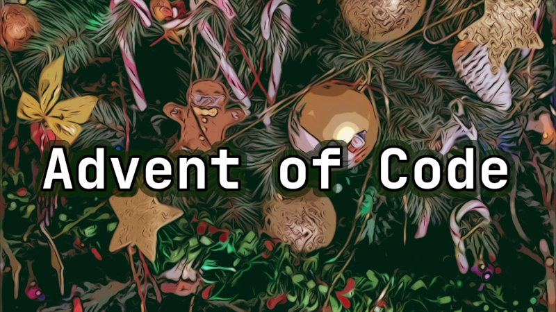

This repository contains my solutions to the Advent of Code puzzles - in **Kotlin**.

I have been recording me solving those puzzles and the videos are available on **YouTube**.
([Playlist](https://www.youtube.com/playlist?list=PLRJ4pSIA9DGs4TApRoTwvAe2R92WjXElv))

* [Day 1](https://www.youtube.com/watch?v=g_awvDAd9f0)
* [Day 2](https://www.youtube.com/watch?v=XHiBxin8KYk)
* [Day 3](https://www.youtube.com/watch?v=nKyAFrCmwtg)
* [Day 4](https://www.youtube.com/watch?v=_-iVrIIHif4)
* [Day 5](https://www.youtube.com/watch?v=RpoMEF2jrHU)
* [Day 6](https://www.youtube.com/watch?v=viBer3OX7CI)
* [Day 7](https://www.youtube.com/watch?v=ELmJBfsN6ow)
* [Day 8](https://www.youtube.com/watch?v=lD8ve2-tGbQ)
* [Day 9](https://www.youtube.com/watch?v=0Rax4myMaAg)
* [Day 10](https://www.youtube.com/watch?v=NHakgkVtnk4)
* [Day 11](https://www.youtube.com/watch?v=JXnaZElDNpw)
* [Day 12](https://www.youtube.com/watch?v=WBTpa9pqsgg)
* [Day 13](https://www.youtube.com/watch?v=2IuW7ne_Yog)
